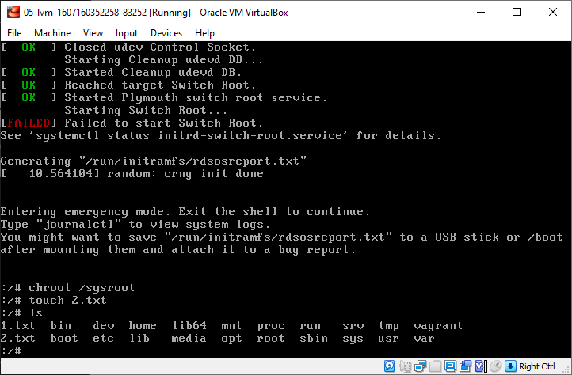

# ДЗ 06. Загрузка системы

Столнулся с трудностями: возникал kernel panic после редактирования grub меню.
<br>
Помогло убрать параметр ```console=ttyS0,115200n8``` загрузки ядра.

## 1. Попасть в систему без пароля несколькими способами

### 1. init=/bin/sh
В меню grub нажимаем ```e```, правим добавляя в конце параметров ядра ```init=/bin/sh``` 
<br>
продолжаем загрузку с поправленными параметрами - нажимаем ```ctl+x```.<br>
После загрузки монтируем fs в режиме для записи
и проверяем через создание файла в корне
<br>

### 2. rd.break
В меню grub нажимаем ```e```, правим добавляя в конце параметров ядра ```rd.break``` 
<br>
загружаемся. <br>
Монтируем fs систему, задаем корень, меянем пароль, уведомляем SElinux для принятия им измененных файлов при перезагрузке, записываем всё на диск.
И два раза ```exit```
<br>
После ребута проверяем - получилось!

### 3. rw init=/bin/sh
Тоже, что и первый вариант, только система сразу монтируется в режиме rw
<br>
Проверяем<br>
<br>
Точно!
 
## 2. Установить систему с LVM, после чего переименовать VG

Смотрим что есть и переименовываем
```
[root@lvm vagrant]# vgs
  VG         #PV #LV #SN Attr   VSize   VFree
  VolGroup00   1   2   0 wz--n- <38.97g    0
[root@lvm vagrant]# vgrename VolGroup00 OtusRoot
  Volume group "VolGroup00" successfully renamed to "OtusRoot"
[root@lvm vagrant]# vi /etc/fstab
```
Правим файлы 
```
/etc/fstab 
/etc/default/grub
/boot/grub2/grub.cfg
```

Пересоздаем initrd
```
[root@lvm vagrant]# mkinitrd -f -v /boot/initramfs-$(uname -r).img $(uname -r)
...
*** Creating initramfs image file '/boot/initramfs-3.10.0-862.2.3.el7.x86_64.img' done ***
```

Перезагружаемся, проверяем: 
```
> vagrant ssh
[vagrant@lvm ~]$ sudo su
[root@lvm vagrant]# vgs
  VG       #PV #LV #SN Attr   VSize   VFree
  OtusRoot   1   2   0 wz--n- <38.97g    0
```

## 3. Добавить модуль в initrd
Скопируем файлы из примера (модули)
```
[root@lvm vagrant]# mkdir /usr/lib/dracut/modules.d/01test/
[root@lvm vagrant]# cp /vagrant/modules/* /usr/lib/dracut/modules.d/01test/
[root@lvm vagrant]# cd /usr/lib/dracut/modules.d/01test
[root@lvm vagrant]# chmod +x test.sh
[root@lvm vagrant]# chmod +x module-setup.sh
[root@lvm vagrant]# dracut -f -v
[root@localhost 01test]# lsinitrd -m /boot/initramfs-$(uname -r).img | grep test
test
```
Проверим, перезагрузимся и в grub menu уберем ```rhgb quiet```
<br>
