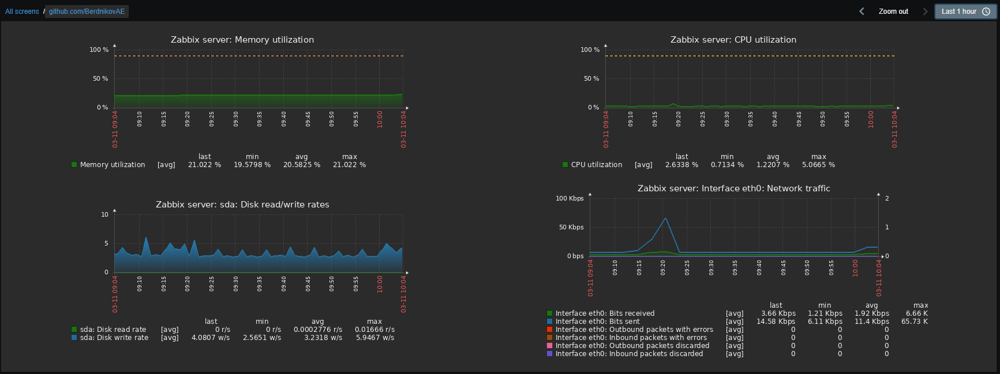

# ДЗ 15. Настройка мониторинга

VM запускается со скриптом [provision.sh](provision.sh), устанавливается 
  - postgres
  - nginx
  - zabbix

## Результат

Помогла статья https://serveradmin.ru/ustanovka-i-nastrojka-zabbix-5-0/

