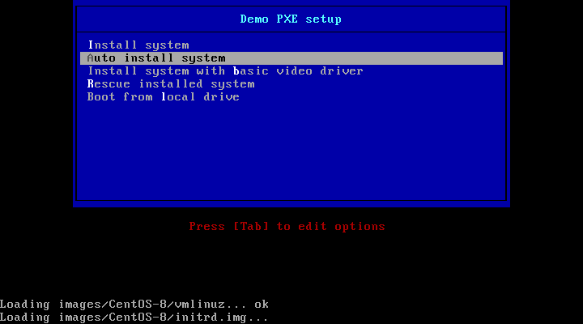

# ДЗ 19. Настройка PXE сервера для автоматической установки

## Задание
Настройка PXE сервера для автоматической установки
https://docs.google.com/document/d/1FfHJy3LVIiZxBqZbRUS_pofMQlmEDNr1HcRiEHjhui0/edit?usp=sharing

Сделать установку по http.

## Решение
Взять лабу https://github.com/nixuser/virtlab/tree/main/centos_pxe

Откорректировать [setup_pxe.sh](setup_pxe.sh):
```sh
# Setup nginx for autoinstall 
# Директория для образов и файлов ответов
mkdir -p /opt/PXE/www
yum install nginx -y
sed -i 's/\/usr\/share\/nginx\/html/\/opt\/PXE\/www/g' /etc/nginx/nginx.conf
sed -i "47 a autoindex on;" /etc/nginx/nginx.conf
# мы уже образ имеем, примаунтим его же
ln -s /mnt/centos8-install/ /opt/PXE/www
systemctl restart nginx
systemctl enable nginx


#поправим /var/lib/tftpboot/pxelinux/pxelinux.cfg/default
append initrd=images/CentOS-8/initrd.img ip=enp0s3:dhcp inst.ks=http://10.0.0.20/ks.cfg inst.repo=http://10.0.0.20/centos8-install
```

В меню установки сделал default-овой автоматическую (silent) установку через ```http```.

Ручную устнановку через ```nfs``` оставил как есть, на память.

## Проверяем
1. 
2. 
3. 
4. 


